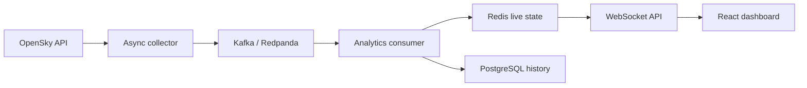

# SkyStream — Real-Time Aircraft Analytics Platform

SkyStream is a production-style event-streaming platform that collects **real, current aircraft telemetry** from the OpenSky Network, publishes aircraft states through Kafka, maintains live analytics in Redis, stores collection history in PostgreSQL, and delivers updates to a professional React dashboard over WebSockets.

The project demonstrates asynchronous Python, event-driven architecture, purpose-built persistence, real-time client delivery, containerisation, observability, automated testing, and Codespaces developer experience.

> OpenSky is an independent public data provider. Availability and completeness vary, and origin/destination airports are not part of the live state-vector feed. The dashboard never generates substitute aircraft when the provider is unavailable.

## Run in GitHub Codespaces

1. Select **Code → Codespaces → Create codespace on main**.
2. If GitHub asks whether you trust the repository, accept it so the terminal and setup can start.
3. Wait for the automatic container build and service startup to finish.
4. In the terminal, print the dashboard link when you are ready:

   ```bash
   bash .devcontainer/show-url.sh
   ```

5. Open the printed port `3000` URL. If necessary, use the **Ports** tab and open the entry labelled **SkyStream Dashboard**.

The page is intentionally not opened automatically: Codespaces may finish setup before the visitor has activated a trusted terminal. The command above lets the visitor request the link at the correct time.

No OpenSky account is required for the demonstration. Anonymous access has stricter provider limits, so the dashboard may temporarily report a degraded provider state.

## Local execution

Requirements: Docker with Docker Compose.

```bash
docker compose up --build
```

- Dashboard: `http://localhost:3000`
- API documentation: `http://localhost:8000/docs`
- Health check: `http://localhost:8000/api/v1/health`

Stop the stack with `docker compose down`. Add `-v` only when you explicitly want to delete local PostgreSQL and Redis volumes.

## Architecture at a glance



Redpanda supplies the Kafka-compatible broker while remaining practical inside a Codespace. Aircraft states use ICAO24 identifiers as partition keys, preserving per-aircraft ordering. Redis serves the current dashboard snapshot with low latency, while PostgreSQL persists collection-level history.

## Documentation

- [System architecture](docs/architecture.md)
- [Backend and API](docs/backend.md)
- [Frontend dashboard](docs/frontend.md)
- [Infrastructure and Codespaces](docs/infrastructure.md)
- [Data source, limitations, and attribution](docs/data-source.md)

## Technology stack

Python 3.12 · FastAPI · asyncio · Kafka/Redpanda · Redis · PostgreSQL · SQLAlchemy · React 19 · TypeScript · Leaflet · Nginx · Docker Compose · GitHub Actions

## Quality controls

CI runs backend linting and tests, builds the TypeScript frontend, and verifies both container images on pushes, pull requests, and manual dispatch. Runtime services include health checks, bounded external timeouts, structured JSON logs, restart policies, non-root backend execution, and graceful shutdown.

## License

Released under the [MIT License](LICENSE).
