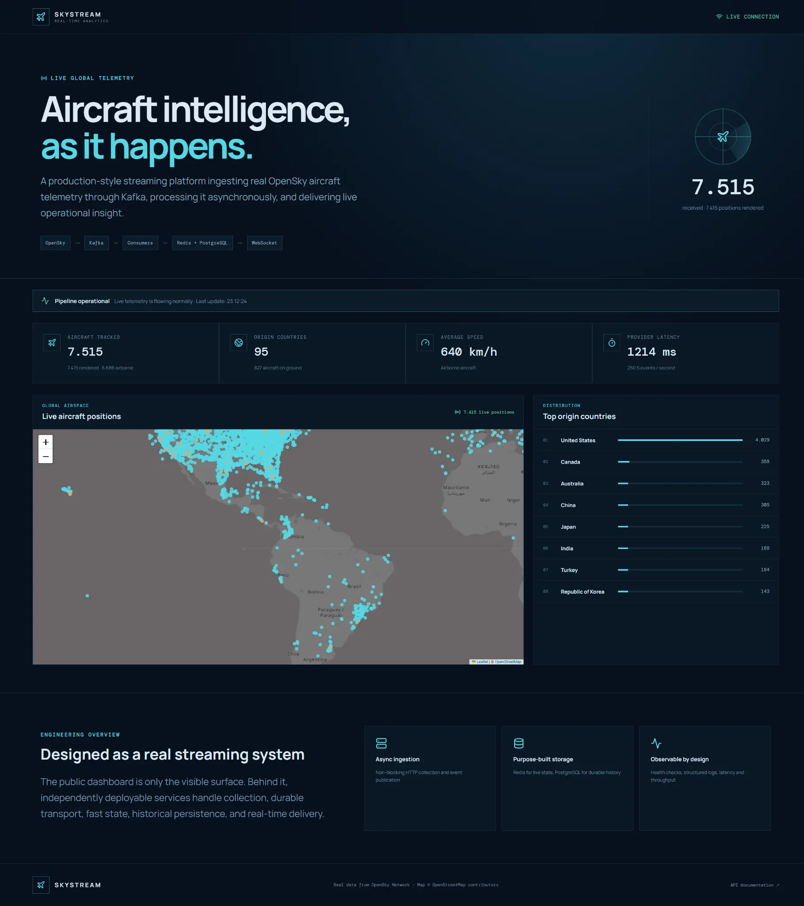
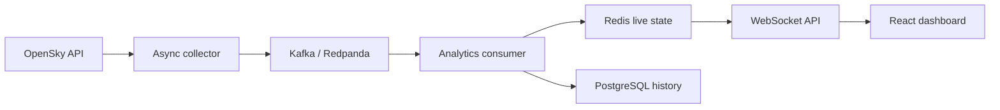

# SkyStream — Real-Time Aircraft Analytics Platform

SkyStream is a production-style event-streaming platform that collects **real, current aircraft telemetry** from the OpenSky Network, publishes aircraft states through Kafka, maintains live analytics in Redis, stores collection history in PostgreSQL, and delivers updates to a professional React dashboard over WebSockets.

The project demonstrates asynchronous Python, event-driven architecture, purpose-built persistence, real-time client delivery, containerisation, observability, automated testing, and Codespaces developer experience.

> OpenSky is an independent public data provider. Availability and completeness vary, and origin/destination airports are not part of the live state-vector feed. The dashboard never generates substitute aircraft when the provider is unavailable.

## Application preview

[](docs/images/application-preview.webp)

## Run in GitHub Codespaces

1. Select **Code → Codespaces → Create codespace on main**.
2. If GitHub asks whether you trust the repository, accept it so the terminal and setup can start.
3. Wait for the automatic container build and service startup to finish.
4. In the terminal, print the dashboard link when you are ready:

   ```bash
   bash .devcontainer/show-url.sh
   ```

5. Open the printed port `3000` URL. If necessary, use the **Ports** tab and open the entry labelled **SkyStream Dashboard**.

The page is intentionally not opened automatically: Codespaces may finish setup before the visitor has activated a trusted terminal. The command above lets the visitor request the link at the correct time.

No OpenSky account is required for the demonstration. Anonymous access has stricter provider limits, so the dashboard may temporarily report a degraded provider state.

## Local execution

Requirements: Docker with Docker Compose.

```bash
docker compose up --build
```

- Dashboard: `http://localhost:3000`
- API documentation: `http://localhost:8000/docs`
- Health check: `http://localhost:8000/api/v1/health`

Stop the stack with `docker compose down`. Add `-v` only when you explicitly want to delete local PostgreSQL and Redis volumes.

## Architecture at a glance



Redpanda supplies the Kafka-compatible broker while remaining practical inside a Codespace. Events use their collection ID as the partition key, keeping every global snapshot and its completion boundary ordered together. Redis serves the current dashboard snapshot with low latency, while PostgreSQL persists collection-level history.

## Key engineering decisions

- **Use a Kafka-compatible event boundary:** collection and analytics are decoupled so telemetry ingestion does not depend on dashboard consumers or database write latency.
- **Partition by collection ID:** every aircraft snapshot and its completion marker stay ordered together, allowing the consumer to aggregate complete collections deterministically.
- **Assign storage by access pattern:** Redis serves the latest dashboard state, while PostgreSQL stores durable collection-level history.
- **Deliver live state through WebSockets:** clients receive updates without repeatedly polling the API.
- **Preserve honest provider state:** failures retain the last valid snapshot and visibly mark it stale rather than generating substitute aircraft.

## Trade-offs

- Redpanda provides Kafka semantics in a compact environment, but still adds more operational overhead than an in-process queue.
- Collection-level partitioning preserves snapshot order but does not maximize parallelism within one global collection.
- Redis makes current-state reads fast, while recovery still depends on rebuilding or repopulating ephemeral state.
- Anonymous OpenSky access removes setup friction but provides stricter limits and variable availability.
- Docker Compose demonstrates the event flow on one host; production streaming would require multi-node capacity planning and stronger failure isolation.

## Documentation

- [System architecture](docs/architecture.md)
- [Backend and API](docs/backend.md)
- [Frontend dashboard](docs/frontend.md)
- [Infrastructure and Codespaces](docs/infrastructure.md)
- [Data source, limitations, and attribution](docs/data-source.md)

## Technology stack

Python 3.12 · FastAPI · asyncio · Kafka/Redpanda · Redis · PostgreSQL · SQLAlchemy · React 19 · TypeScript · Leaflet · Nginx · Docker Compose · GitHub Actions

## Quality controls

CI runs backend linting, formatting, tests and dependency auditing; frontend linting, formatting, production compilation and dependency auditing; and a health-gated Compose smoke test on pushes, pull requests, and manual dispatch. Runtime services include dependency-aware health checks, bounded external timeouts, structured JSON logs, restart policies, non-root backend execution, and graceful shutdown. Dependabot monitors Python, npm, Docker, and GitHub Actions dependencies.

The event consumer commits Kafka offsets only after a complete collection is aggregated and persisted. Invalid external rows are isolated, incomplete collections are bounded, and provider failures retain the last valid data while visibly marking the dashboard degraded.

## Data and privacy

SkyStream processes public OpenSky telemetry and does not accept user uploads or personal information. Redis holds the current dashboard snapshot; PostgreSQL stores aggregate collection counts and provider latency rather than individual aircraft history. These local Docker volumes belong to the Codespace and disappear when that Codespace is deleted unless someone explicitly exports them.

## License

Released under the [MIT License](LICENSE).
